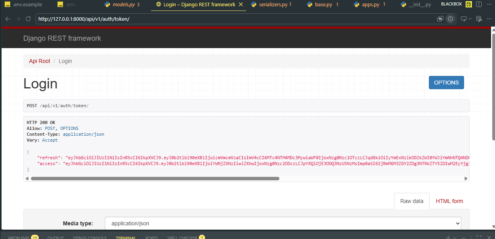
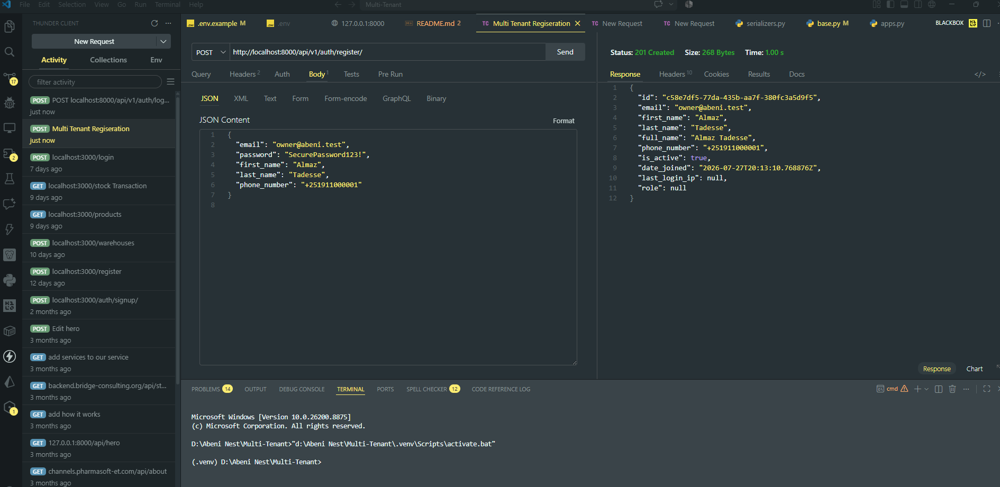
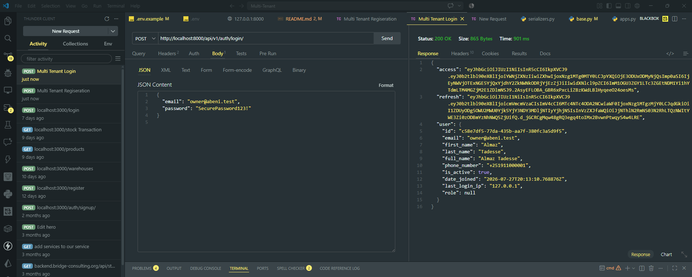
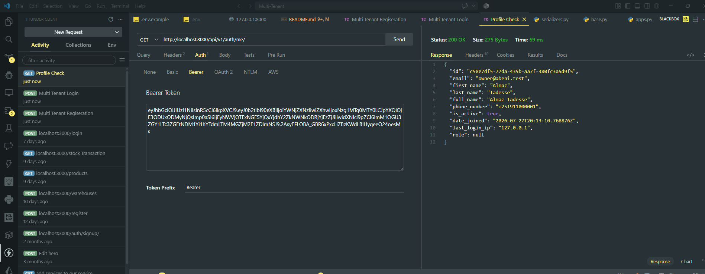
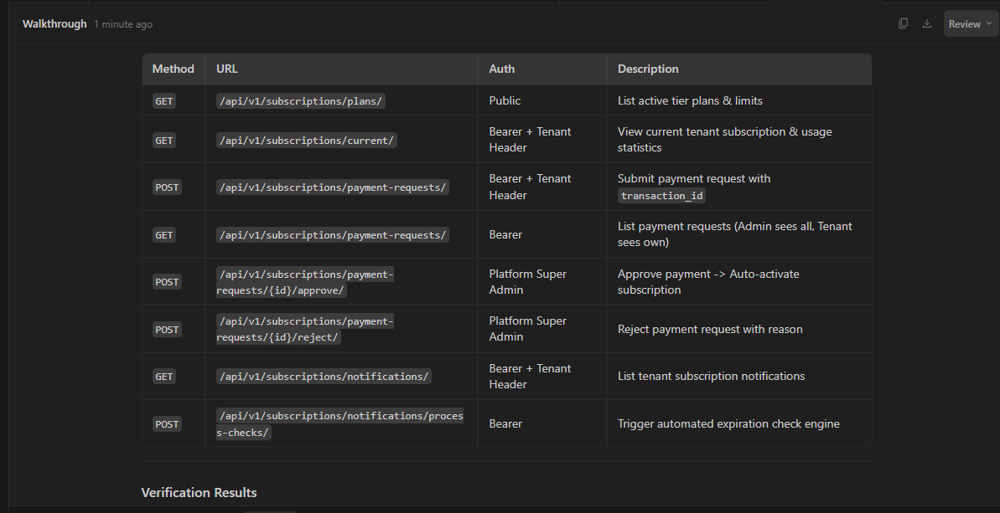

# Pharmacy SaaS Backend

Production-oriented multi-tenant pharmacy management API built with Django 5,
Django REST Framework, PostgreSQL, and JWT authentication.

## Architecture

This project is a modular monolith. The `config` package owns deployment and
framework wiring. Shared concerns live in `core`; business capabilities are
bounded into `tenants`, `accounts`, `catalog`, `inventory`, `sales`, and
`audit`. API adapters call application services, and services coordinate
repositories and domain rules. Direct cross-tenant ORM access is not permitted
in application services.

The tenant boundary is explicit. A request is authenticated as a user and
authorized through tenant membership; business records carry a tenant foreign
key and repositories require a tenant context. This supports thousands of
pharmacy organizations in one deployment while preserving a migration path to
PostgreSQL row-level security or database-per-tenant isolation for larger
customers.

## Local setup

1. Create and activate a Python 3.12+ virtual environment.
2. Install dependencies with `pip install -r requirements.txt`.
3. Copy `.env.example` to `.env` and provide PostgreSQL credentials.
4. Run `python manage.py migrate`.
5. Run `python manage.py test`.
6. Start the API with `python manage.py runserver`.

The API version prefix is `/api/v1/`. Authentication uses JWT access and
refresh tokens. The database, secret key, allowed hosts, and token lifetimes
are environment-driven.

First Test for Authentication of Tenants and  others 

Register a User(Owner) 

01. Register Users:

POST http://localhost:8000/api/v1/auth/register/

{
  "email": "owner@abeni.test",
  "password": "SecurePassword123!",
  "first_name": "Almaz",
  "last_name": "Tadesse",
  "phone_number": "+251911000001"
}

Repeat for manager, cashier, inventory, pharmacist, accountant, superadmin

02. Login:

POST http://localhost:8000/api/v1/auth/login/

{
  "email": "owner@abeni.test",
  "password": "SecurePassword123!"
}

Receive access & refresh tokens
Use access token for protected endpoints

Loign with Created User

03. Profile & Role Verification:

GET http://localhost:8000/api/v1/auth/me/

04. Logout (Token Blacklist):

POST http://localhost:8000/api/v1/auth/logout/

{
  "refresh": "<refresh_token>"
}

05. Token Refresh:

POST http://localhost:8000/api/v1/auth/token/refresh/

{
  "refresh": "<refresh_token>"
}

06. Password Reset:

POST http://localhost:8000/api/v1/auth/password/reset/ with {"email": "owner@abeni.test"}
POST http://localhost:8000/api/v1/auth/password/confirm/ with token UUID

07. Login Audit History:

GET http://localhost:8000/api/v1/auth/login-history/

Subscription Model

